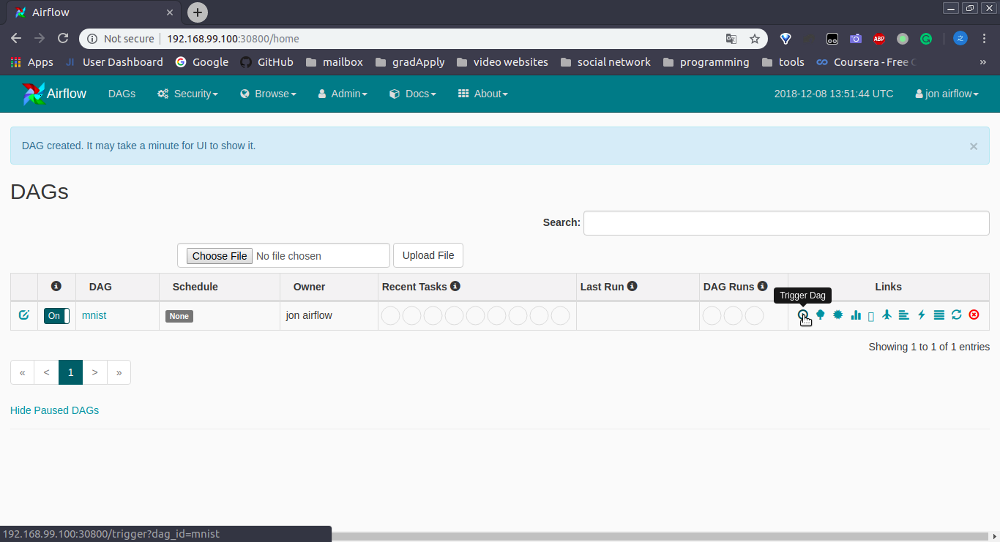
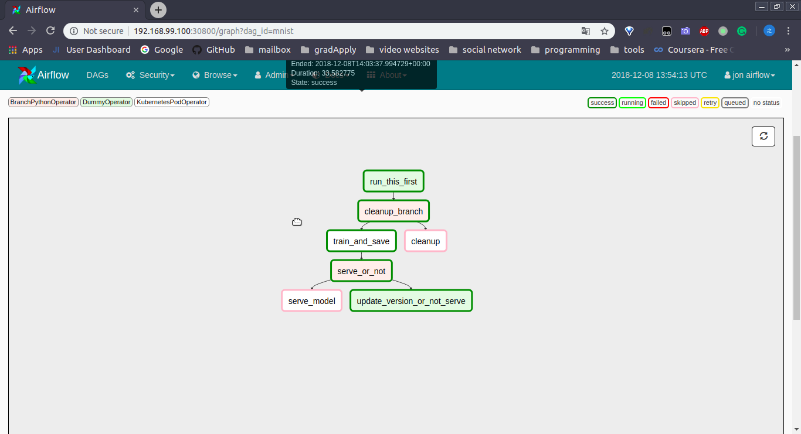
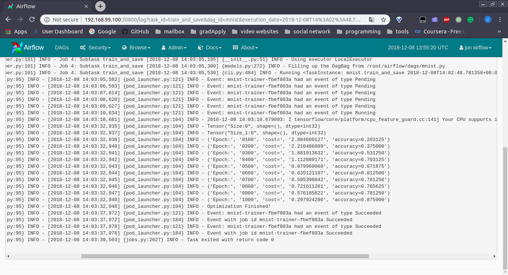

# ve450-airflow-on-k8s
#### JI capstone project
#### Edge Computing Declarative Deployment Framework

### Prerequisites
* Docker
    * Chinese users can use registry.docker-cn.com to have faster speed
* Minikube(k8s)
    * Chinese user can find a minikube compiled by Chinese which replaces google sources.
    * Refer to https://kubernetes.io/docs/setup/minikube/ for more instructions.
    * When you start it, remember to give it more cpus and memory through `--cpus` and `--memory`

### Airflow
* Version 1.10.1
* Edit `airflow/airflow/contrib/kubernetes` to implement functions needed in this project
* Add an file upload field in homepage.
    * Edit `airflow/airflow/www_rbac/templates/airflow/dags.html` to create the form.
    * Edit `airflow/airflow/www_rbac/views.py` and `airflow/airflow/models.py` to parse files uploaded.

### Guides
1. In `airflow-container/`, `media-container` and `tf-container/`, run `build.sh` to build the image
2. In `kube/`, run `deploy.sh` to deploy airflow on minikube. Check `volumes.yaml` to modify the space PVs occupy.
3. After airflow pods are up, run `cd runtime && copy.sh` to copy files into PV.
4. You can access airflow web ui on localhost:30800
5. To run demos, compress files in `demo/deep-learning` or `demo/media` to a zip, and upload it on the UI
6. The web UI pick up dags in a period, so please wait some time and refresh to see your dag.
7. To run it, first unpause it (switch to on), and then trigger it by clicking the left first buttuon among icons on the right.
8. Refresh the webpage you can see the status of subtasks in your dag. Go to task instance via graph view or tree view, etc, 
to view the log.
9. To delete your dag, click the red button on the right of each dag. If you have run a deep-learning workflow with `serve: true`,
you need to add `cleanup: true` to the `JOBCONFIG.yaml`, upload it and trigger it again on UI to fully delete it.(the pod and 
service of restapi)

### Screenshots
1. How to run a dag:

2. Graph view of a dag:

3. Click on the task to check its log:

### To-do lists
* Create more containers/templates to satisfy various workloads
* Optimize `runtime/dl_template.py`
* [optional] Switch from yaml to json to get rid of PyYaml?

